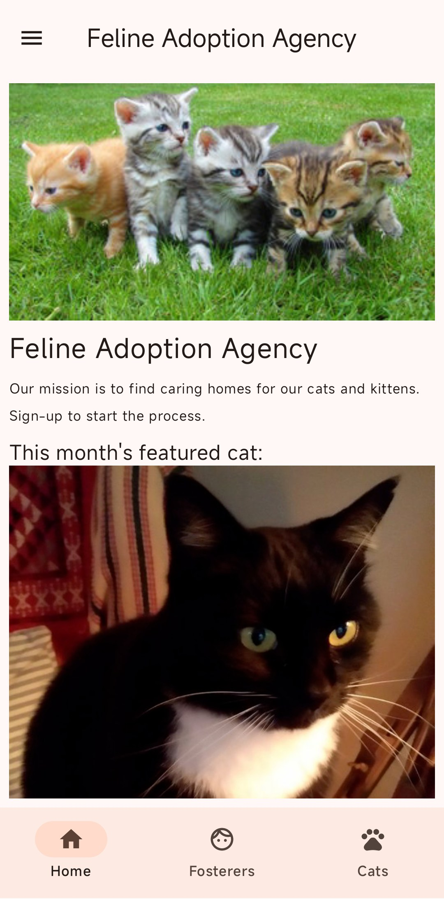
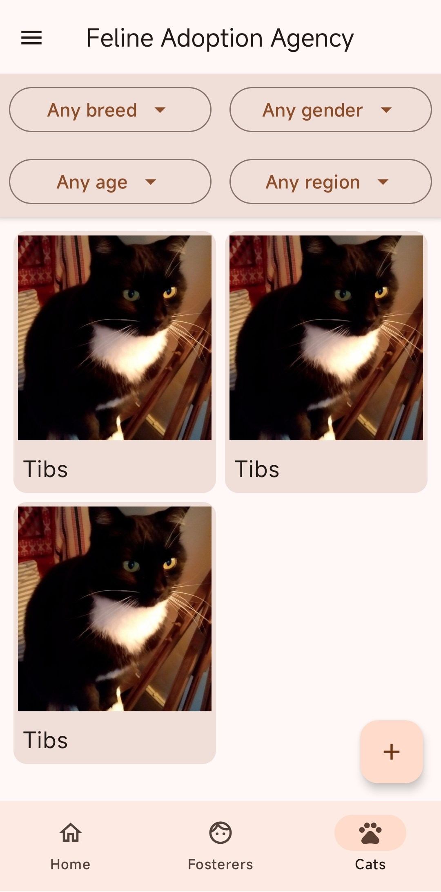
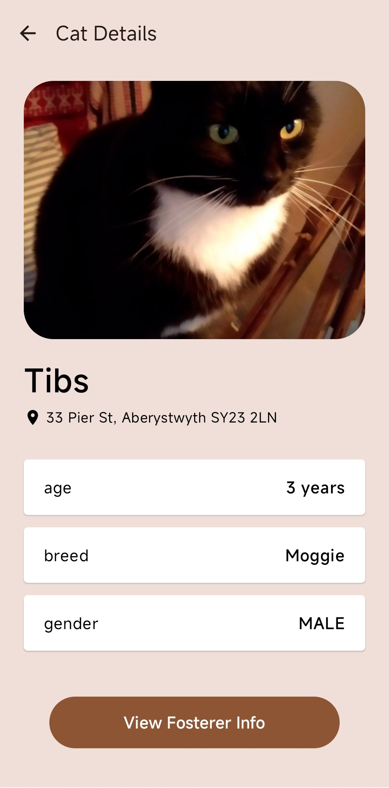
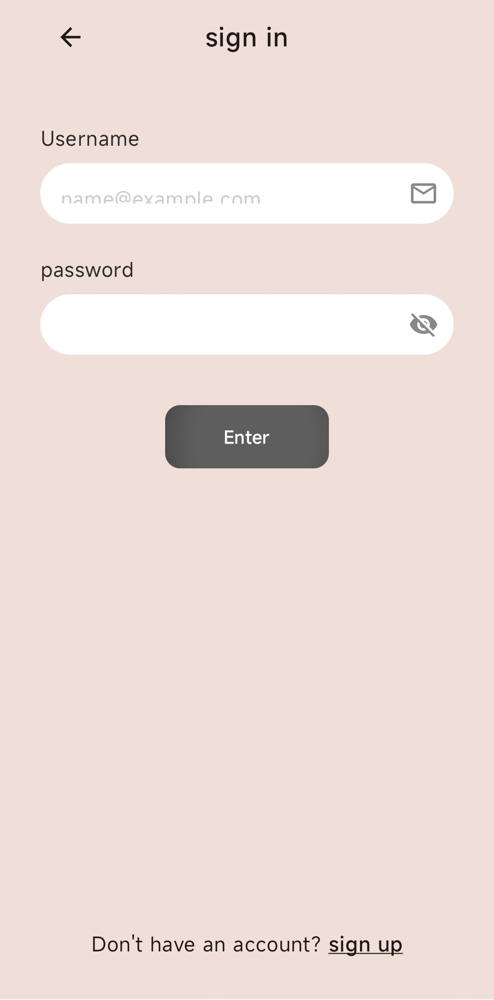
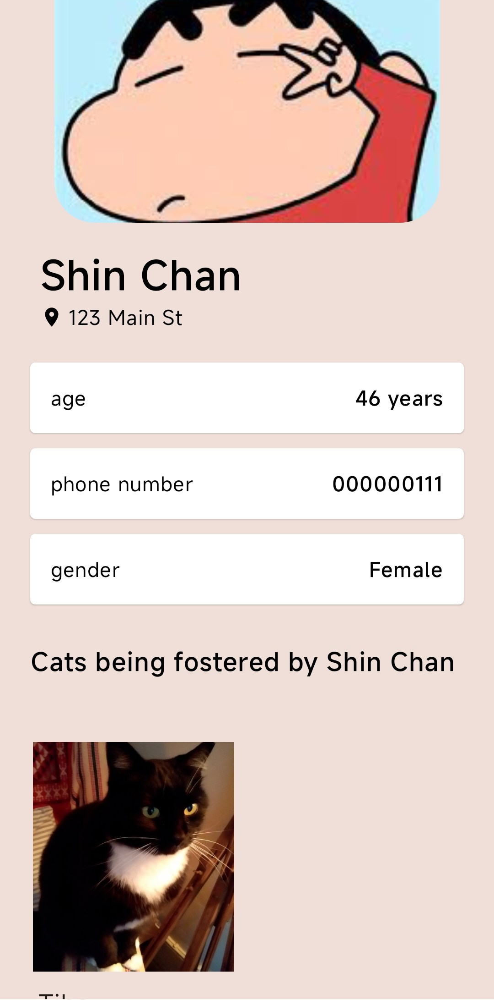
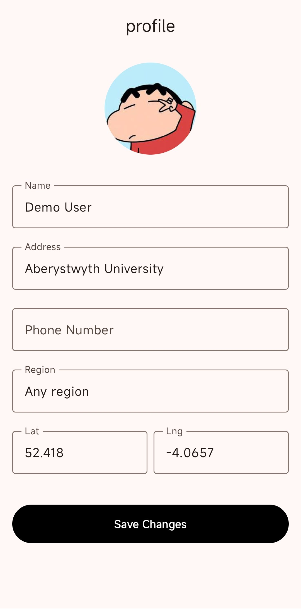

# Feline Adoption App (FAA)

An Android application for browsing, searching, adopting and fostering cats. Built
with Kotlin and Jetpack Compose as the assessed coursework (Assignment 1) for
**CS31620 – Mobile Development with Android** at **Aberystwyth University**
(academic year 2025–26).

This repository contains the completed and submitted coursework, published as a
personal portfolio piece.

The base app — navigation scaffolding, the initial screens and the Room database
setup — comes from the FAA workshop template provided by the CS31620 module. The
Assignment 1 features are my own work: adopter accounts and authentication,
fosterer management, distance- and region-based filtering, and the editable
adopter profile.

## Features

- **Browse cats** available for adoption with image, name, breed, gender and age
- **Cat details** screen showing full information for a selected cat
- **Search & filtering** – search the catalogue, with distance- and region-based
  filters available to logged-in users
- **Adopter accounts** – login / sign-up flow and an editable adopter profile
  (location and regional preferences)
- **Fosterers** – browse fosterer profiles and view the cats in each fosterer's care
- **Add a cat** to the database (image picked from the device)
- **Home screen** highlighting featured cats
- Light/dark theme with Material 3 dynamic colour support (Android 12+)

## Screenshots

| Home | Browse & filter cats | Cat details |
|:---:|:---:|:---:|
|  |  |  |
| **Adopter login** | **Fosterer profile** | **Edit adopter profile** |
|  |  |  |

_Captured from the app running on a device, using the seeded demo data._

## Tech stack

| Area | Technology |
|------|-----------|
| Language | Kotlin 2.2.0 |
| UI | Jetpack Compose, Material 3, Compose Navigation, ConstraintLayout Compose |
| Architecture | MVVM – `ViewModel` + `LiveData`, repository pattern |
| Persistence | Room 2.7.2 (with KSP) |
| Image loading | Glide Compose / Coil Compose |
| Build | Android Gradle Plugin 8.9.3, Gradle wrapper |
| SDK | `compileSdk` / `targetSdk` 35, `minSdk` 26, Java 11 |

## Project structure

```
app/src/main/java/uk/ac/aber/dcs/cs31620/faa/
├── MainActivity.kt
├── datasource/      Room database, repository, seed data, type converters
├── model/           Entities (Cat, Adopter, Fosterer), DAOs and ViewModels
└── ui/              Compose UI
    ├── authentication/   Login / sign-up
    ├── cats/             Cats list, cat details, add cat
    ├── components/       Reusable UI (cards, app bar, nav bar/drawer, filters)
    ├── fosterers/        Fosterer list, profile and their cats
    ├── home/             Home screen
    ├── navigation/       Navigation routes
    └── theme/            Colours, typography, theming

docs/partA-design/   Design mockups produced for Part A of the assignment
docs/screenshots/    App screenshots shown in this README
```

## Design mockups

Early UI designs created for Part A of the assignment are kept under
[`docs/partA-design/`](docs/partA-design):


## Building and running

1. Install [Android Studio](https://developer.android.com/studio) (latest stable).
2. Clone this repository and open the project folder in Android Studio.
3. Android Studio generates `local.properties` automatically on first open. If
   building from the command line, create it in the project root pointing at your
   Android SDK:
   ```properties
   sdk.dir=/path/to/your/Android/Sdk
   ```
4. Let Gradle sync finish, then **Run** the `app` configuration on an emulator or
   device running Android 8.0 (API 26) or higher.

Command-line build:

```bash
./gradlew assembleDebug      # macOS / Linux
gradlew.bat assembleDebug    # Windows
```

## Demo account

The app seeds a demo adopter account on first launch, so you can explore the
logged-in features (fosterer search and contact, profile editing) without
signing up first:

- **Username:** `user`
- **Password:** `password`

## Licence

Released under the [MIT Licence](LICENSE).

## Academic integrity note

This is completed and submitted university coursework, shared for portfolio
purposes only. If you are currently enrolled on CS31620, do not copy or submit
this code — doing so is plagiarism under Aberystwyth University's academic
regulations.
